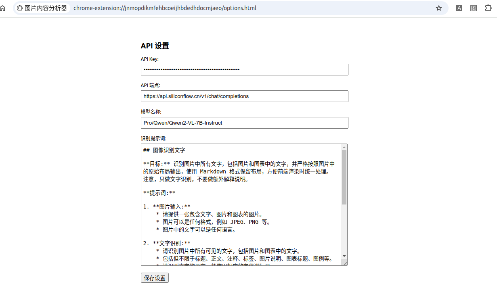
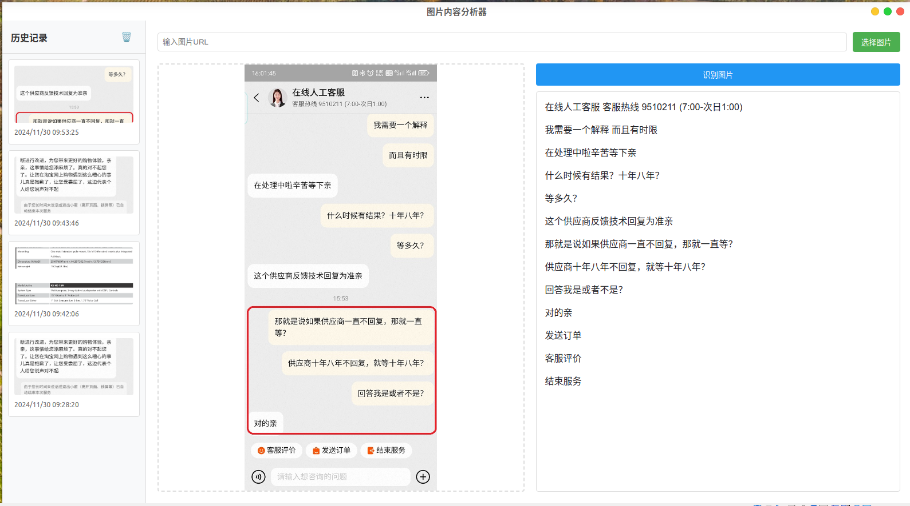
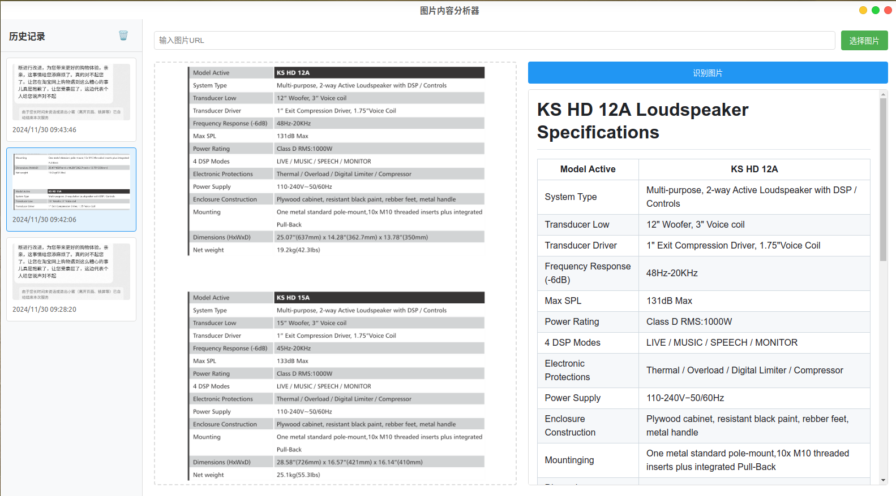

## Chrome AI 图片分析扩展程序

调用视觉大模型的在线 API 服务，分析图片内容的 chrome/edge 扩展程序。

## 使用截图

- 安装插件

下载这个项目，解压后，打开 chrome 或 edge 浏览器，进入 `chrome://extensions/` 或`edge://extensions/`页面，点击“加载已解压的扩展程序”，选择解压后的文件夹即可。

安装完成后，右键点击此“图片内容分析器”图标，选中“选项”，进入配置页面，配置大模型 API 信息。

首先，需要配置大模型 API 信息。此外，**具体需要视觉大模型完成什么功能，需要自己添加识别提示词**。

- 使用示例

基础的可以作为图片文字识别工具

输出文本:

输出 markdown 表格：

## 其他说明

- 首先，我完全不懂 chrome 扩展开发，本项目由 cursor 问答生成，测试使用效果还行
- 其次，服务的实现由视觉大模型在线 API 服务实现，所以需要配置大模型 API 信息
  - 我测试使用的是硅基流动中模型 `Pro/Qwen/Qwen2-VL-7B-Instruct`。
  - 如果对硅基流动平台感兴趣，还能用下我的邀请码注册，那就先谢过了：
  - https://cloud.siliconflow.cn/i/tRIcST68
- 然后，我的所有的 chrome 插件都没上传 Chrome/Edge 应用商店。
  - 除了需要注册开发者账号的 5 美元之外，由于代码不是亲自编写，所以不敢保证项目没有其他问题
- 最后，本项目和本人其他chrome扩展项目都仅用于学习交流，请勿用于其他用途。
